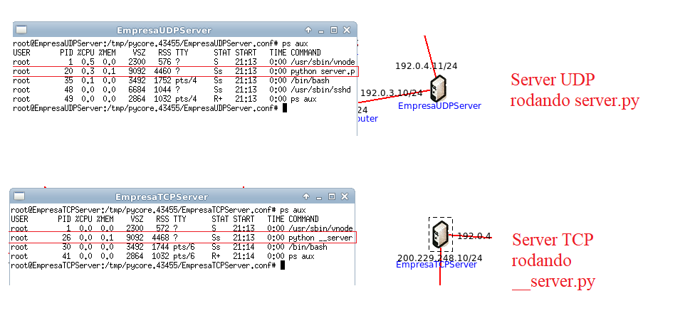

# Topologia da Rede está em empresa.imn 
- Aquivo do Emulador Core que simboliza a topologia de rede da empresa é ``empresa.imn``

# Sistema de comunicação
- Todos os possiveis cliente que vão utilizar os serviços da empresa são representados pelo host ``Client``
- ``UDPClient`` representa o cliente do game ao usar conexão upd para jogar.
- Existem dois servidores importantes, que é o ``EmpresaTCPServer``, 
que ira ajudar na comunicação que precisa de mais estabilidade entre o os servições da empresa e o cliente
esse servidor é chamado toda vez que precisa de alguma chamada toda vez que precisa autentica o cliente e mandar dados que precisam de estabilidades.
- ``EmpresaUDPServer`` é o servidor responsavel pela rapida troca de 
mensagem passada para os cliente quando estão jogando no Game Online da Empresa. 
Precisa ser UDP pois esse tempo de resposta precisa ser rapido, mas ao mesmo tempo não é critico se houver peca de pacotes.

# Hosts Servidor
- Já os outros são servidores, o que serve paginas html da empresa é o host ``EmpresaHTTPServer``, esse host roda o codigo do arquivo ``httpserver.py`` dessa repo como ilustração, devolvendo ao usuario o conteudo de ``ganhamu.html`` dessa repo.
- ``EmpresaTCPServer`` roda o código ``tcpserver.py`` desse repo, para garantir que a comunicação é fiel e está sendo feita entre os clientes  
- ``EmpresaUDPServer`` roda o código ``udpserver.py`` desse repo, para garantir que a comunicação é fiel e está sendo feita entre os clientes  

# Testando Cliente
- Rode ``python cliente.py``shell do host ``Client`` para se connectar ao host server ``EmpresaTCPServer``
- Rode ``python cliente.py``shell do host ``UDPClient`` para se connectar ao host server ``EmpresaUDPServer``
- Rode ``wget http://199.212.0.73:80``shell do host ``EmpresaHTTPServer``
- Em seguinda, rode ``cat index.html`` pra ver o html recebido da EmpresaHTTPServer

# Configuração de Routers/Hosts/Servers
#### Os scripts abaixo foram configurados na mão para exercitar o enitendimento de gateways, rotas etc...

#### $ ps aux nos servidores
